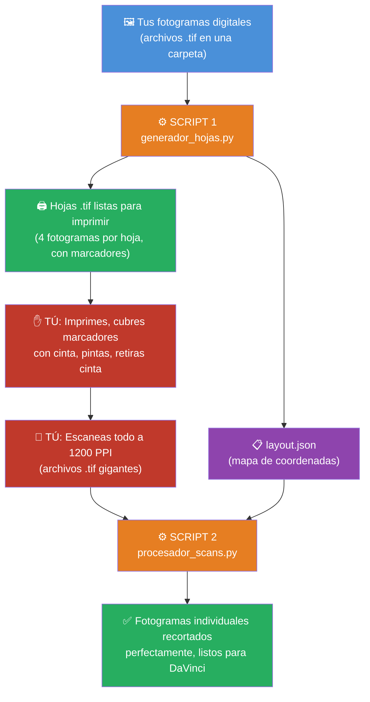

# 🎨 Guía de Uso — Pipeline de Mixed Media para Animación

## ¿Qué hace este sistema?

Este sistema automatiza tu flujo de trabajo de animación *mixed media*. En vez de recortar manualmente cada fotograma en Photoshop después de escanear, el sistema lo hace por ti de forma matemáticamente perfecta, preservando la calidad original del escáner.



---

## Requisitos Previos (solo la primera vez)

### 1. Instalar Python

1. Abre tu navegador y ve a: **https://www.python.org/downloads/**
2. Descarga la versión más reciente (botón amarillo grande).
3. **MUY IMPORTANTE**: Al instalar, marca la casilla **☑ "Add Python to PATH"** antes de hacer clic en "Install Now".
4. Reinicia tu computadora después de instalar.

### 2. Instalar `uv` (el gestor de paquetes)

1. Abre **PowerShell** (búscalo en el menú de inicio, clic derecho → "Ejecutar como administrador").
2. Copia y pega este comando y presiona Enter:

```powershell
powershell -ExecutionPolicy ByPass -c "irm https://astral.sh/uv/install.ps1 | iex"
```

3. Cierra y vuelve a abrir PowerShell.

### 3. Preparar el proyecto (solo una vez)

1. Abre **PowerShell** (ya no necesitas "como administrador").
2. Navega hasta la carpeta del proyecto. Por ejemplo, si la carpeta está en tu Escritorio:

```powershell
cd C:\Users\TU_NOMBRE\Desktop\kamiru_mxm_scans_helper
```

> **Nota:** Reemplaza `TU_NOMBRE` con tu nombre de usuario de Windows.

3. Instala las dependencias:

```powershell
uv sync
```

Esto descargará todo lo necesario automáticamente. Solo tienes que hacerlo **una vez**.

---

## Paso a Paso: Flujo Completo

### FASE 1 — Generar las Hojas de Impresión

#### ¿Qué necesitas?
- Una carpeta con tus fotogramas digitales en formato `.tif` (pueden ser 4K, Full HD, etc.)

#### Pasos:

1. **Crea una carpeta** dentro del proyecto llamada, por ejemplo, `mis_frames` y coloca ahí todos tus fotogramas `.tif`.

2. **Abre PowerShell** y navega a la carpeta del proyecto:

```powershell
cd C:\Users\TU_NOMBRE\Desktop\kamiru_mxm_scans_helper
```

3. **Ejecuta el generador de hojas:**

```powershell
uv run python generador_hojas.py --input mis_frames --output mis_hojas
```

Donde:
| Parámetro | Qué significa |
|-----------|--------------|
| `--input mis_frames` | La carpeta donde están tus fotogramas originales |
| `--output mis_hojas` | La carpeta donde se guardarán las hojas para imprimir |

4. **Resultado:** En la carpeta `mis_hojas` encontrarás:
   - Archivos `hoja_001.tif`, `hoja_002.tif`, etc. — **estas son las hojas que vas a imprimir**
   - Un archivo `layout.json` — **NO lo borres ni lo muevas, lo necesita el Script 2**

> **¿Cómo se ven las hojas?** Cada hoja tiene 4 fotogramas organizados en una grilla de 2×2, con un código QR y el nombre debajo de cada uno, y unos cuadrados negros pequeños (marcadores ArUco) en las 4 esquinas.

---

### FASE 2 — Tu Trabajo Físico (Imprimir, Pintar, Escanear)

#### Pasos:

1. **Imprime** las hojas `.tif` generadas. Asegúrate de que la impresora esté configurada a **300 PPI** y en el tamaño de papel correcto (A4).

2. **Coloca cinta adhesiva** (*masking tape*) sobre:
   - Los 4 cuadrados negros de las esquinas (marcadores ArUco)
   - Los códigos QR y el texto debajo de cada fotograma

3. **Pinta libremente** sobre los fotogramas. Puedes salirte un poco de los bordes, no hay problema.

4. **Retira la cinta adhesiva** con cuidado. Los marcadores y QRs deben quedar limpios y legibles.

5. **Escanea** todas las hojas pintadas con estas configuraciones:
   - **Formato:** TIFF (`.tif`)
   - **Resolución:** 1200 PPI
   - **Color:** A todo color (RGB)
   - **Profundidad de bits:** 16 bits por canal (si tu escáner lo permite, si no, 8 bits está bien)

6. **Guarda los escaneos** en una carpeta, por ejemplo `mis_escaneos`.

---

### FASE 3 — Procesar los Escaneos (Recortar Automáticamente)

#### ¿Qué necesitas?
- La carpeta con tus escaneos (ej. `mis_escaneos`)
- El archivo `layout.json` que se generó en la Fase 1 (está dentro de `mis_hojas`)

#### Pasos:

1. **Abre PowerShell** y navega a la carpeta del proyecto:

```powershell
cd C:\Users\TU_NOMBRE\Desktop\kamiru_mxm_scans_helper
```

2. **Ejecuta el procesador de escaneos:**

```powershell
uv run python procesador_scans.py --input mis_escaneos --layout mis_hojas/layout.json --output mis_frames_finales
```

Donde:
| Parámetro | Qué significa |
|-----------|--------------|
| `--input mis_escaneos` | La carpeta donde están tus escaneos a 1200 PPI |
| `--layout mis_hojas/layout.json` | La ruta al archivo `layout.json` de la Fase 1 |
| `--output mis_frames_finales` | La carpeta donde se guardarán los fotogramas recortados |

3. **Parámetro opcional — Bleed (sangrado):**

Si notas que los bordes de tus fotogramas recortados tienen un pequeño borde blanco del papel, puedes ajustar el "bleed" (cuánto recorta hacia adentro):

```powershell
uv run python procesador_scans.py --input mis_escaneos --layout mis_hojas/layout.json --output mis_frames_finales --bleed 0.01
```

| Valor de bleed | Efecto |
|----------------|--------|
| `0.001` | Recorta muy poco (casi nada) |
| `0.01` | Recorte suave (recomendado para empezar) |
| `0.015` | Recorte moderado (valor por defecto) |
| `0.02` | Recorte agresivo (si pintas hasta el borde exacto) |

4. **Resultado:** En la carpeta `mis_frames_finales` encontrarás archivos como:
   - `CLIP OFICIAL018_procesado.tif`
   - `CLIP OFICIAL019_procesado.tif`
   - etc.

   Cada archivo es tu fotograma pintado, recortado perfectamente y en la máxima calidad posible. Puedes importar estos directamente a **DaVinci Resolve**.

---

## Resumen Rápido (Cheat Sheet)

```
PASO 1: Generar hojas
uv run python generador_hojas.py --input [CARPETA_FRAMES] --output [CARPETA_HOJAS]

PASO 2: Imprimir → Poner cinta → Pintar → Quitar cinta → Escanear a 1200 PPI

PASO 3: Procesar escaneos
uv run python procesador_scans.py --input [CARPETA_ESCANEOS] --layout [CARPETA_HOJAS]/layout.json --output [CARPETA_SALIDA]
```

---

## Solución de Problemas Comunes

### "No se detectaron los 4 ArUcos"
- **Causa:** La cinta no se retiró completamente de algún marcador de esquina, o el escaneo cortó una esquina.
- **Solución:** Verifica que los 4 cuadrados negros de las esquinas estén completamente visibles y limpios. Vuelve a escanear esa hoja.

### "Códigos QR ilegibles"
- **Causa:** Quedó pintura sobre el código QR.
- **Solución:** Asegúrate de cubrir bien los QRs con cinta antes de pintar.

### Los colores se ven diferentes
- **Causa más común:** El monitor no está calibrado o el programa de visualización no respeta perfiles ICC.
- **Solución:** Abre el archivo en Photoshop o DaVinci Resolve (que sí respetan perfiles ICC) para ver el color real.

### Los archivos de salida son muy grandes
- **Esto es normal.** Los archivos se guardan sin compresión para preservar la máxima calidad. Un fotograma a 1200 PPI puede pesar entre 50-100 MB. Esto es intencional.

---

## Estructura de Carpetas (Ejemplo)

```
kamiru_mxm_scans_helper/
├── generador_hojas.py          ← Script 1
├── procesador_scans.py         ← Script 2
├── pyproject.toml              ← Configuración del proyecto
├── mis_frames/                 ← Tus fotogramas originales
│   ├── CLIP OFICIAL018.tif
│   ├── CLIP OFICIAL019.tif
│   └── ...
├── mis_hojas/                  ← Hojas generadas (Fase 1)
│   ├── hoja_001.tif
│   ├── hoja_002.tif
│   └── layout.json             ← ¡NO BORRAR!
├── mis_escaneos/               ← Tus escaneos a 1200 PPI (Fase 2)
│   ├── scan_001.tif
│   ├── scan_002.tif
│   └── ...
└── mis_frames_finales/         ← Resultado final (Fase 3)
    ├── CLIP OFICIAL018_procesado.tif
    ├── CLIP OFICIAL019_procesado.tif
    └── ...
```
